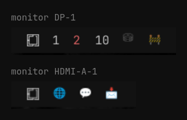

# Workspace Names & Monitors

An [Omarchy](https://omarchy.org) bar widget (Quickshell / omarchy-shell) that
shows **named** Hyprland workspaces, and shows each monitor only its own.



It is a clone of the built-in `omarchy.workspaces` widget with two changes:

- **Keyed by workspace name, not id.** The built-in widget filters to
  `id > 0 && id <= 10` and renders the id, so named workspaces never show up:
  Hyprland assigns them negative ids (a workspace named `🚧` might be `-1337`).
  This widget lists workspaces by name and renders the name — so emoji, words,
  or Nerd Font glyphs all work as labels.
- **Per-monitor.** Each bar instance shows only the workspaces bound to the
  output it is drawn on, the way waybar's `persistent-workspaces` map did.
  Membership is read from Hyprland at runtime, so your `workspace` rules stay
  the single source of truth and there is nothing to keep in sync here.

Numeric workspaces sort first, in numeric order. Named ones follow, in the
order given by `namedOrder` (see [Configuration](#configuration)).

Clicking a workspace focuses it. Numeric workspaces are dispatched by number,
named ones by `name:`, so an emoji is never parsed as an id.

## Requirements

- Omarchy 4.x with `omarchy-shell` (Quickshell bar)
- Hyprland

No external commands, services, or dependencies beyond the shell itself.

## Install

```bash
omarchy plugin add https://github.com/rame0/omarchy-workspace-icons.git --enable
```

That clones, validates, and installs the plugin, then asks which bar section to
place it in — pick **left**. To skip the prompts and place it exactly:

```bash
omarchy plugin add https://github.com/rame0/omarchy-workspace-icons.git --yes
omarchy plugin enable rame0.workspace-icons --section left --before omarchy.active-window
```

`--index N` and `--after <id>` work as alternatives to `--before`.

Since this replaces the built-in workspaces widget, turn that one off:

```bash
omarchy plugin disable omarchy.workspaces
```

Named workspaces come from your Hyprland config, not from this widget. For
example, in `~/.config/hypr/hyprland.lua`:

```lua
hl.workspace_rule({ workspace = "name:🚧", monitor = "DP-1", persistent = true, default = true })
hl.workspace_rule({ workspace = "name:🌐", monitor = "HDMI-A-1", persistent = true, default = true })
```

## Configuration

There is no config schema. The one thing worth editing is the display order of
named workspaces, near the top of `Workspaces.qml`:

```qml
readonly property var namedOrder: ["⛁", "🚧", "🌐", "💬", "📩"]
```

This is cosmetic only. Names absent from the list sort after it,
alphabetically. Changes reload automatically; `omarchy-shell shell
rescanPlugins` forces a re-read.

Position in the bar is stored in `bar.layout` in `~/.config/omarchy/shell.json`
and is easiest to change with `omarchy plugin enable` as shown above.

## Update

```bash
omarchy plugin update rame0.workspace-icons
```

## Uninstall

```bash
omarchy plugin remove rame0.workspace-icons
omarchy plugin enable omarchy.workspaces --section left
```

`remove` deletes the plugin and drops it from the bar layout. The widget writes
nothing outside its own plugin directory, so nothing else needs cleaning up.

## Develop

```bash
omarchy plugin validate ~/.config/omarchy/plugins/rame0.workspace-icons
qmllint -I /usr/share/omarchy/shell ~/.config/omarchy/plugins/rame0.workspace-icons/Workspaces.qml
omarchy-shell shell rescanPlugins
```

## License

[MIT](LICENSE)
